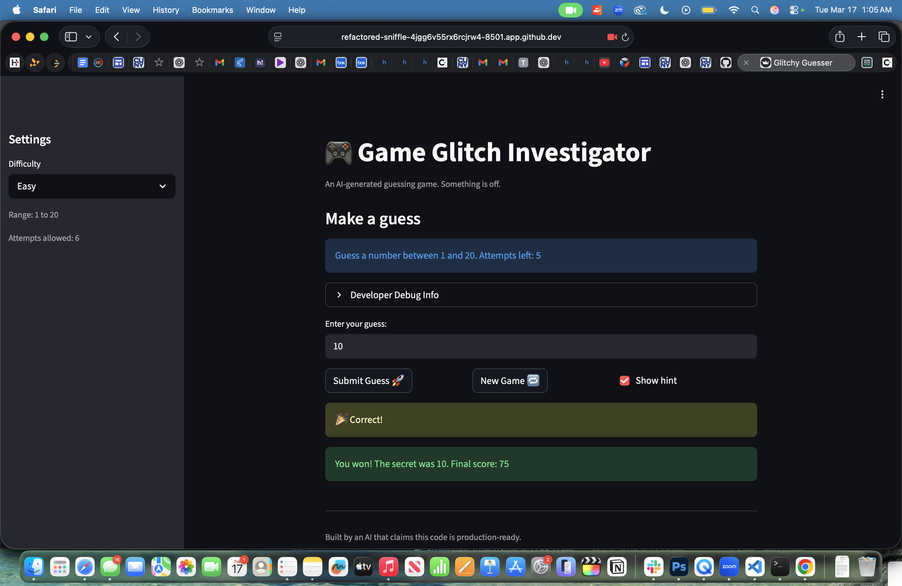

# 🎮 Game Glitch Investigator: The Impossible Guesser

## 🚨 The Situation

You asked an AI to build a simple "Number Guessing Game" using Streamlit.
It wrote the code, ran away, and now the game is unplayable. 

- You can't win.
- The hints lie to you.
- The secret number seems to have commitment issues.

## 🛠️ Setup

1. Install dependencies: `pip install -r requirements.txt`
2. Run the broken app: `python -m streamlit run app.py`

## 🕵️‍♂️ Your Mission

1. **Play the game.** Open the "Developer Debug Info" tab in the app to see the secret number. Try to win.
2. **Find the State Bug.** Why does the secret number change every time you click "Submit"? Ask ChatGPT: *"How do I keep a variable from resetting in Streamlit when I click a button?"*
3. **Fix the Logic.** The hints ("Higher/Lower") are wrong. Fix them.
4. **Refactor & Test.** - Move the logic into `logic_utils.py`.
   - Run `pytest` in your terminal.
   - Keep fixing until all tests pass!

## 📝 Document Your Experience

- [ ] Describe the game's purpose.
The purpose of the game is to find the secret number by guessign higher or lower from your previous attempt. 
- [ ] Detail which bugs you found.
___________________________________________________ ERROR collecting tests/test_game_logic.py ________________________________________________________
ImportError while importing test module '/workspaces/ai110-module1show-gameglitchinvestigator-starter/tests/test_game_logic.py'.
Hint: make sure your test modules/packages have valid Python names.
Traceback:
/usr/local/python/3.12.1/lib/python3.12/importlib/__init__.py:90: in import_module
    return _bootstrap._gcd_import(name[level:], package, level)
           ^^^^^^^^^^^^^^^^^^^^^^^^^^^^^^^^^^^^^^^^^^^^^^^^^^^^
tests/test_game_logic.py:1: in <module>
    from logic_utils import check_guess
- [ ] Explain what fixes you applied.
New game didn't reset status, score, or history; used hardcoded range so Resets all state; uses low/high,

"Too High" randomly gave +5 or -5 based on even/odd attempts so now it Always deducts 5

Score used attempt_number + 1 (off-by-one) so Changed to attempt_number

## 📸 Demo

- [ ] [Insert a screenshot of your fixed, winning game here]

## 🚀 Stretch Features

- [ ] [If you choose to complete Challenge 4, insert a screenshot of your Enhanced Game UI here]
